# 保险经纪助理 — Clickable Demo PRD

> **文档目的**: 给 AI coding agent（Claude Code / Codex / Gemini 等）一份能直接照着跑出 clickable demo 的产品需求文档。
> **demo 性质**: 纯前端可点击演示，**不连真实接口、不持久化数据**，所有数据用截图里出现的文案作为 mock。
> **目标观众**: 太平洋保险等保险公司管理层 / 业务团队的演示场景。

---

## 1. 项目背景

保险经纪人日常痛点：知识体系庞杂沉淀慢、客户洞察靠记忆、老保单缺口判断难、客户跟进无优先级、获客渠道单一。本工具是基于企业微信生态的"经纪助理"小程序，提供智能工作台 + AI 客户热度模型 + AI 跟进方案生成 + 自动客户旅程 + 运营任务批量触达 + 智能内容运营 + 智能活动邀约 七大核心能力。

本次 demo 目标：把所有核心页面跑通一条**可点击的体验链路**，让观众能从首页一路点到底，看到状态变化（如 tab 切换、勾选、提交）。

---

## 2. 技术约束

| 项 | 要求 |
|---|---|
| 形态 | 移动端 H5 或 React 小程序模拟（推荐 React + Vite + TailwindCSS） |
| 屏幕尺寸 | 按 iPhone 14/15 标准视口（375 × 812）设计，移动端 viewport |
| 顶部状态栏 | 保留截图里的 09:25 / 信号 / WiFi / 电池 样式即可，不接系统 API |
| 右上角胶囊 | 保留截图里的 `···` 和 `⊙` 小程序胶囊样式（纯装饰，不可点击） |
| 数据存储 | 无后端，状态用 React state / Context 即可；**不要用 localStorage** |
| 假数据 | 全部来自 figma 截图里的文字，不要自己编造 |
| 动效 | **不需要动效**，按钮点击有最基础的 active 反馈即可 |
| 路由 | 用 React Router 或同级方案，每个页面有独立 URL，方便测试 |
| 字体 | 系统默认（中文：苹方 / PingFang SC；西文：sans-serif） |
| 主色 | 黑色 `#000000`（按钮主色）、白色 `#FFFFFF`（背景）、浅灰 `#F5F5F7`（卡片底）；强调色蓝 `#3D7BFF`（仅用于打开率等数据强调） |

---

## 3. 全局结构

### 3.1 底部 tab bar（5 个）

所有"主要页面"都带底部 tab bar。tab 顺序与图标：

| 顺序 | 名称 | 对应页面 | 备注 |
|---|---|---|---|
| 1 | 任务 / 首页 | `/home` | 见 §6.1 |
| 2 | 工具 | `/tools` | 见 §6.6 |
| 3 | 顾客 | `/customers` | 见 §6.2 |
| 4 | 数据 | `/data` | **本期不做**，点击保持当前页或弹一个"建设中"toast |
| 5 | 我 | `/me` | **本期不做**，同上 |

> ⚠️ 注：图里有的版本写"灵感"有的写"任务"，**统一用"任务"**。

### 3.2 子页面（无 tab bar）

子页面顶部带返回箭头 `<`，**不**显示底部 tab bar。例如：客户详情页、拜访记录分析、AI 跟进建议、多日待办、自动客户旅程、运营任务详情、朋友圈发布、活动邀约详情等。

### 3.3 命名与文案统一

| 错误 / 旧 | 正确 / 统一 |
|---|---|
| 代办 | **待办** |
| 客户推荐 | **为你推荐**（带 ✨ AI 角标） |
| 灵感 | **任务** |

---

## 4. 路由表（sitemap）

```
/home                                    首页（任务 tab）
/customers                               客户档案列表（顾客 tab，默认标签模式）
/customers?mode=quadrant                 客户档案列表（四象限模式）
/customers/:id                           客户详情页（默认热度模型收起）
/customers/:id?heat=expanded             客户详情页（热度模型展开各维度）
/customers/:id/visit-record              拜访记录分析（上传态）
/customers/:id/visit-record?state=done   拜访记录分析（已分析态）
/customers/:id/followup                  下一步建议（AI 推荐方案）
/customers/:id/followup/tasks            下一步事项（拆解为多任务，多选编辑）
/customers/:id/todo-list                 多日待办列表（静态展示）
/tools                                   工具箱（工具 tab）
/journey                                 自动客户旅程（D1 默认）
/journey?stage=D3                        自动客户旅程（D3 阶段）
/journey/batch-send                      批量发送弹窗（modal）
/operation                               运营任务列表
/operation/:id                           运营任务详情（中秋祝福等）
/material                                素材库首页
/material/content?type=education         教育险内容推荐列表
/material/moments                        朋友圈素材库
/material/moments/publish                发布朋友圈
/material/content-task/:id               内容任务详情页（带数据回传）
/activity                                活动邀约详情页
/activity/invite-list                    邀约名单
/activity/records                        邀约记录
```

---

## 5. 假数据规则

- **优先用截图里的文字**，包括客户姓名（王女士、王建国、李雅琴、张明远、陈雪梅、林德华、于贝儿、Cloudy、Roise LI、LI hehe、Jack Wang、Chloe Tian 等）、产品名（D21311KP71-BK/XL 等）、文案、数字。
- 涉及数据状态变化时（如点击后勾选），**不需要持久化**，用组件 state 即可。
- 截图里被遮挡或灰色占位（如活动详情的灰条），保持灰条占位即可。

---

## 6. 页面规格

> 每一节附 figma 截图作为视觉真值（visual source of truth）。**截图为准**，PRD 文字描述用来补充交互、状态、跳转。

---

### 6.1 首页（任务 tab）

**路由**: `/home`
**底部 tab**: 显示，激活"任务"
**入口**: 默认启动页 / 底部 tab "任务"

#### 6.1.1 默认状态（为你推荐 = 重点客户 tab）

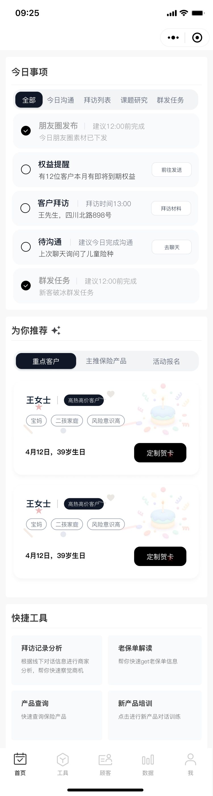

**页面结构（从上到下）**:

1. **顶部胶囊** `···` / `⊙` —— 纯装饰
2. **今日事项** 区块
   - 顶部分类 tab（**横向滚动**）：`全部` / `今日沟通` / `拜访列表` / `课题研究` / `群发任务`
     - 默认选中"全部"
     - 点击切换时，下方列表筛选对应类型（demo 阶段：点击后只切换 tab 高亮，下方列表保持原样亦可）
   - 任务卡片列表，每条卡片包含：
     - 左侧**圆形勾选框**（未完成空心、已完成实心黑底 + 白色对勾）
     - 任务标题（如"朋友圈发布"）
     - 副标题（如"建议12:00前完成 · 今日朋友圈素材已下发"）
     - 右侧操作按钮（如"前往发送"、"拜访材料"、"去聊天"）
   - **状态变化**：点击勾选框 → 该任务卡片整体置灰（透明度 50%），勾选框变实心
3. **为你推荐 ✨** 区块
   - 内部 tab（**横向 segmented control**）：`重点客户` / `发点什么` / `活动报名`
     - 默认选中"重点客户"
     - 点击切换 → 替换下方内容（具体内容见 §6.1.2、§6.1.3）
   - 重点客户卡片（生日提醒类）：
     - 客户名 + "高热高价客户" 标签 + 装饰元素（生日蛋糕 emoji 即可）
     - 客户标签 chips：`宝妈` / `二孩家庭` / `风险意识高`
     - 日期 + 年龄："4月12日，39岁生日"
     - 右下角主按钮"定制贺卡" (黑底白字)
   - **点击"定制贺卡"**：跳转 `/customers/:id`（客户详情页）
4. **快捷工具** 区块（2 × 2 grid）：
   - 拜访记录分析 / 老保单解读 / 产品查询 / 新产品培训
   - **点击"拜访记录分析"**：跳转 `/customers/:id/visit-record`（用默认 :id，比如 `王女士` 的 id = "wang")
   - 其他点击保持当前页或弹"建设中"toast

#### 6.1.2 为你推荐 = 发点什么 tab

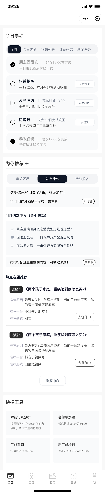

切换"发点什么"后，下方替换为：

- 顶部激励条："这周你已经创造了2篇，继续加油！11月创作激励榜已发布，去看看" + 右侧"排行榜"按钮（demo 阶段排行榜点击保持当前页）
- **11月选题下发（企业选题）** 卡片：3 个 `# 标签`-style 选题
  - 儿童重疾险到底选消费型还是返还型？
  - 保险怎么选：一份保障方案配置全攻略
  - 保险怎么选：一份保障方案配置全攻略
  - 底部行："发布符合企业主题的内容，可领取激励！" + "去领取"按钮
- **热点选题推荐**：2 张卡片
  - 选题 1 / 选题 2 标签 + 选题标题（带书名号）
  - 推荐原因 / 推荐平台 / 推荐形式 三行属性
  - 右下角"去创作 >"按钮 → 点击跳转 `/material/moments/publish`
- 底部"选题中心"按钮（保持当前页或建设中 toast）

#### 6.1.3 为你推荐 = 活动报名 tab

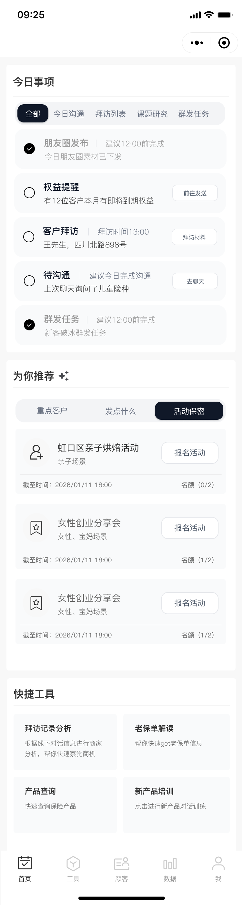

切换"活动报名"后，下方替换为活动卡片列表：

- 虹口区亲子烘焙活动（亲子场景，截至 2026/01/11 18:00，名额 0/2）
- 女性创业分享会（女性、宝妈场景，名额 1/2）×2
- 每张卡片右上角"报名活动"按钮 → 点击跳转 `/activity`（活动邀约详情页）

#### 6.1.4 交互规则

| 触发 | 行为 |
|---|---|
| 点击"今日事项" tab | 切换 tab 高亮 |
| 点击任务卡片左侧勾选框 | 任务置灰 + 勾选框变实心 |
| 点击任务"前往发送" / "拜访材料" / "去聊天" | 跳转对应模块（去聊天可保持当前页或 toast，前往发送 → `/material/moments/publish`，拜访材料 → `/customers/:id/visit-record`） |
| 点击"为你推荐" segmented control | 切换内部 tab，替换下方内容 |
| 点击重点客户卡片"定制贺卡" | 跳转 `/customers/:id` |
| 点击活动卡片"报名活动" | 跳转 `/activity` |
| 点击底部 tab | 切换主页面 |

---

### 6.2 客户档案（顾客 tab）

**路由**: `/customers`
**底部 tab**: 显示，激活"顾客"
**入口**: 底部 tab "顾客"

#### 6.2.1 默认（标签筛选模式）

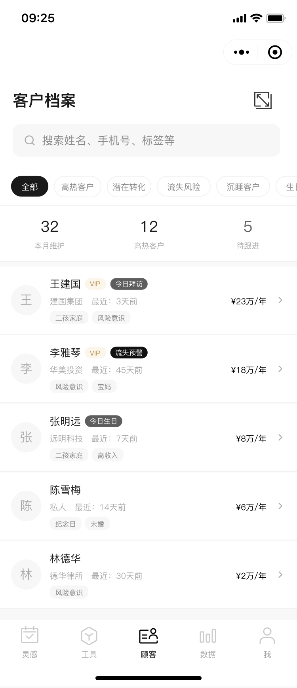

**结构**:

1. 标题"客户档案" + 右上角**模式切换按钮**（图标 `↗`），点击切换到四象限模式
2. 搜索框 (placeholder "搜索姓名、手机号、标签等")，**仅展示，不实现搜索**
3. 横向滚动 chips：`全部`（默认选中黑底）/ `高热客户` / `潜在转化` / `流失风险` / `沉睡客户` / `生日`
   - 点击切换高亮，列表保持不变即可
4. 数据卡片 3 列（本月维护 32 / 高热客户 12 / 待跟进 5）
5. 客户列表（每行）：
   - 左侧字母圆形头像
   - 客户名 + 可能的徽章（VIP 金色 / 今日拜访 黑色 / 流失预警 黑色 / 今日生日 黑色）
   - 子行：所在公司/类型 + 最近联系时间
   - 标签 chips：二孩家庭 / 风险意识 / 宝妈 / 高收入 / 纪念日 / 未婚 等
   - 右侧：年保费 ¥XX万/年 + `>`
   - **点击整行**：跳转 `/customers/:id`

#### 6.2.2 四象限模式

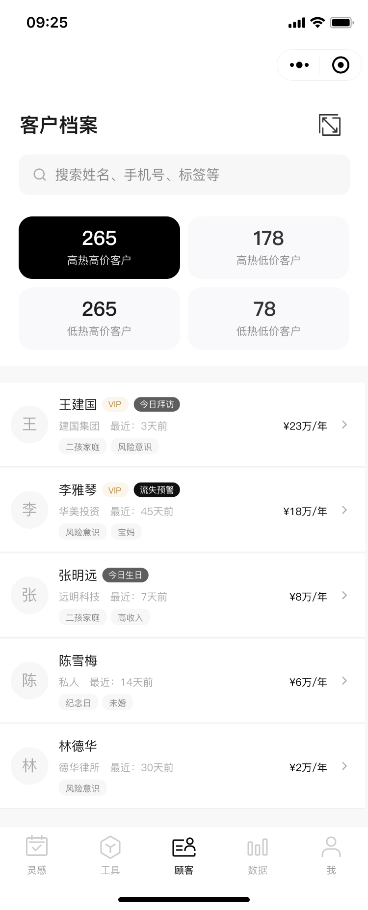

切换后顶部 chips 区被替换为 **2×2 方格**：

| | 高价 | 低价 |
|---|---|---|
| **高热** | 265 高热高价客户（默认选中，黑底） | 178 高热低价客户 |
| **低热** | 265 低热高价客户 | 78 低热低价客户 |

- 点击任一方格 → 该格变黑底白字，其他三格白底；下方列表保持不变（demo 不实际筛选）
- 右上角切换按钮可切回标签模式

#### 6.2.3 交互规则

| 触发 | 行为 |
|---|---|
| 点击模式切换 `↗` 按钮 | 在标签模式 / 四象限模式之间切换 |
| 点击 chip / 象限格 | 切换高亮，列表不变 |
| 点击客户行 | 跳转 `/customers/:id` |
| 点击搜索框 | 仅装饰，不响应 |

---

### 6.3 客户详情页

**路由**: `/customers/:id`
**底部 tab**: 不显示
**入口**: 客户档案行点击 / 首页"为你推荐"卡片点击 / 多个二级页"返回"

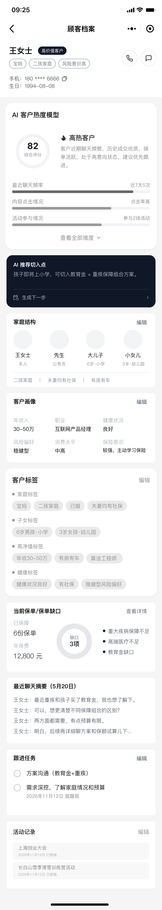

**结构（从上到下，长滚动页）**:

1. **顶栏**: `<` 返回 / 标题"顾客档案" / `···` `⊙` 胶囊
2. **客户头部**:
   - 姓名"王女士" + "高价值客户" 黑色标签
   - 标签 chips: 宝妈 / 二孩家庭 / 风险意识高
   - 手机：180 \*\*\*\* 6666（右边复制图标）
   - 生日：1994-08-08
   - 右上角两个圆形按钮：📞 电话 / 💬 消息（点击不响应或 toast）
3. **AI 客户热度模型 卡片**:
   - 左：综合评分 82（圆环，圆内大字）
   - 右：🔥 高热客户 + 描述文字
   - 下方 3 个进度条维度（默认显示）：
     - 最近聊天频率 - 近7天5次
     - 内容点击情况 - 点击率高
     - 活动参与情况 - 参与2场活动
   - 底部"查看全部维度 v"，**点击展开**为完整维度（见 §6.3.1）
4. **AI 推荐切入点 卡片**（黑底白字）:
   - "孩子即将上小学，可切入教育金 + 重疾保障组合方案。"
   - 底部"生成下一步" 按钮（带 ✨ 图标）
   - **点击 → 跳转 `/customers/:id/followup`**（见 §6.5）
5. **家庭结构 卡片**:
   - 4 个圆形头像 + 名字 + 关系：王女士本人 / 先生 公务员 / 大儿子 6岁·小学 / 小女儿 3岁·幼儿园
   - 底部标签：二孩家庭 / 夫妻均有社保 / 有房有车
   - 右上角"编辑"（demo 不响应）
6. **客户画像 卡片**:
   - 3 列：年收入 30-50万 / 职业 互联网产品经理 / 健康状况 良好
   - 第二行：风险偏好 稳健型 / 消费水平 中高 / 保险意识 较强，主动学习保险
7. **客户标签 卡片**: 分组
   - 家庭标签：宝妈 / 二孩家庭 / 已婚 / 夫妻均有社保
   - 子女标签：6岁男孩·小学 / 3岁女孩·幼儿园
   - 高净值标签：年收30-50万 / 有房有车 / 算法工程师
   - 健康标签：健康状况良好 / 有社保 / 稳健型风险偏好
8. **当前保单/保单缺口 卡片**:
   - 左：已保障 6份保单 / 年保费 12,800元
   - 中：圆环（缺口 3项）
   - 右：重大疾病保障不足 / 高端医疗不足 / 教育金缺口
   - 右上角"查看详情"
9. **最近聊天摘要（5月20日）卡片**:
   - 4 行对话气泡（王女士 / 我）
10. **跟进任务 卡片**:
    - 方案沟通（教育金+重疾） ⭕
    - 需求深挖，了解家庭情况和预算 ⭕
    - 2026年11月12日 提醒我
11. **活动记录 卡片**:
    - 上海创业大会 已邀请
    - 长白山雪季滑雪训练营活动 已邀请

#### 6.3.1 热度模型展开各维度

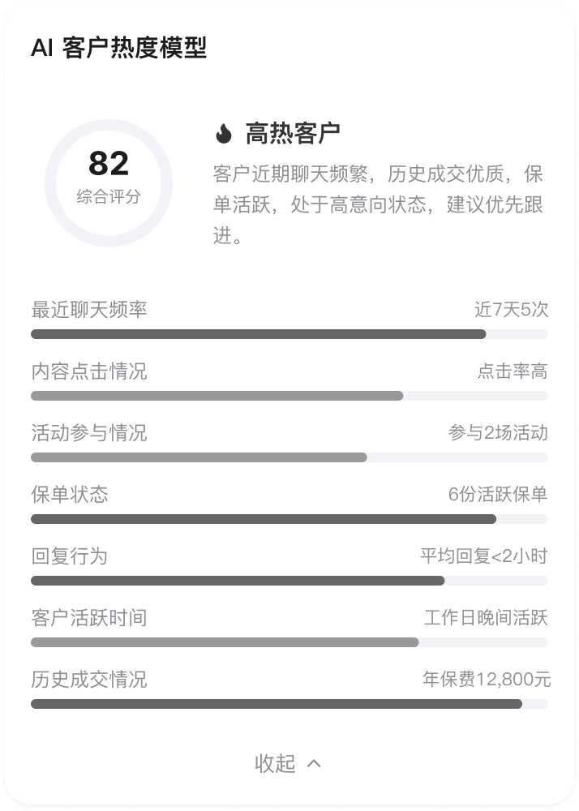

点击"查看全部维度 v"后，热度卡片**就地展开**显示 7 个维度：

- 最近聊天频率（近7天5次）
- 内容点击情况（点击率高）
- 活动参与情况（参与2场活动）
- 保单状态（6份活跃保单）
- 回复行为（平均回复 < 2小时）
- 客户活跃时间（工作日晚间活跃）
- 历史成交情况（年保费12,800元）

底部按钮文字变为"收起 ^"。

#### 6.3.2 交互规则

| 触发 | 行为 |
|---|---|
| 点击"查看全部维度" | 卡片就地展开 / 收起 |
| 点击"生成下一步" | 跳转 `/customers/:id/followup` |
| 点击各卡片"编辑" | 不响应（demo 不做编辑） |
| 点击"查看详情"（保单） | 不响应或 toast |
| 点击 📞 / 💬 | 不响应 |
| 点击 `<` 返回 | 浏览器历史返回 |

---

### 6.4 拜访记录分析

**入口**: 首页"快捷工具"→ 拜访记录分析 / 首页今日事项"拜访材料"按钮

#### 6.4.1 上传态（默认）

**路由**: `/customers/:id/visit-record`

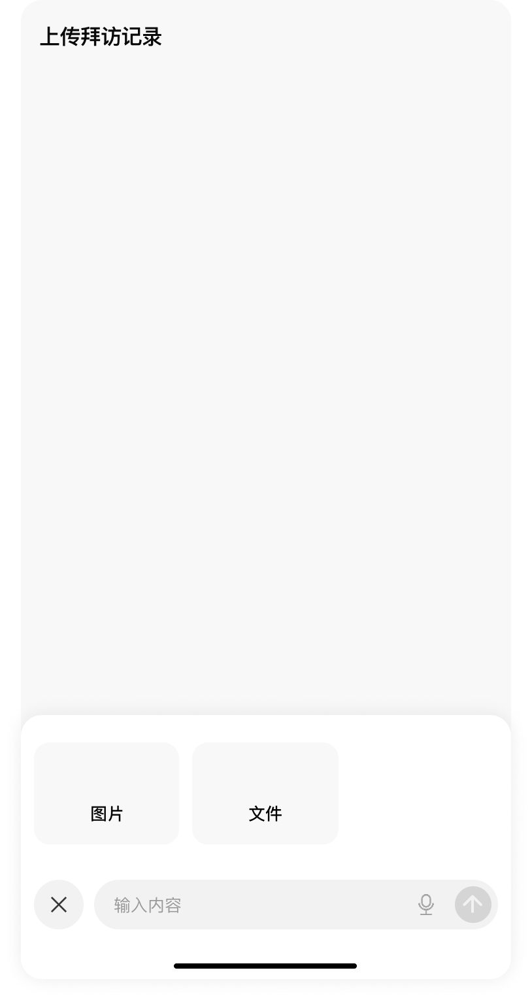

**结构**:

1. 顶部标题"上传拜访记录"
2. 中间大片空白（占位）
3. 底部固定输入区：
   - 上方两个选项：📷 图片 / 📄 文件（demo 阶段点击均无响应或 toast）
   - 下方输入栏：
     - 左侧 `×` 关闭图标（点击返回首页）
     - 中间文本输入框（placeholder "输入内容"）
     - 右侧🎙 麦克风图标 + ↑ 发送按钮（圆形，默认置灰）
   - 当输入框有文字 → 发送按钮变深色可点击
   - **点击发送** → 切换到"已分析态"（见 §6.4.2）

#### 6.4.2 已分析态

**路由**: `/customers/:id/visit-record?state=done`

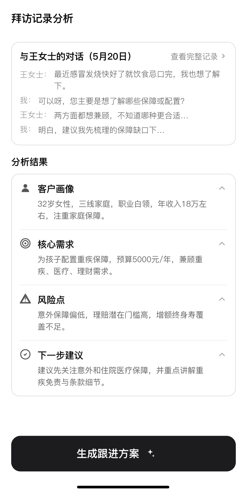

**结构**:

1. 标题"拜访记录分析"
2. **与王女士的对话（5月20日）卡片**: 显示 4 行对话气泡 + 右上角"查看完整记录 >"（点击不响应）
3. **分析结果** 区，4 个可折叠卡片，**默认全部展开**：
   - 👤 客户画像：32岁女性，三线家庭，职业白领，年收入18万左右，注重家庭保障。
   - 🎯 核心需求：为孩子配置重疾保障，预算5000元/年，兼顾重疾、医疗、理财需求。
   - ⚠️ 风险点：意外保障偏低，理赔潜在门槛高，增额终身寿覆盖不足。
   - ✅ 下一步建议：建议先关注意外和住院医疗保障，并重点讲解重疾免责与条款细节。
   - 右上角 `^` 可单独折叠 / 展开
4. 底部黑色大按钮"生成跟进方案 ✨"
   - **点击 → 跳转 `/customers/:id/followup`**（同样进入下一步建议页）

#### 6.4.3 交互规则

| 触发 | 行为 |
|---|---|
| 点击图片/文件 | 不响应或 toast |
| 输入文字 | 发送按钮变可点击 |
| 点击发送 | 切换到已分析态（同页 state 变化或路由参数变化均可） |
| 点击卡片 `^` | 该卡片就地折叠/展开 |
| 点击"生成跟进方案" | 跳转 `/customers/:id/followup` |
| 点击 `×` | 返回首页 |

---

### 6.5 AI 跟进方案生成

#### 6.5.1 下一步建议（推荐方案）

**路由**: `/customers/:id/followup`
**底部 tab**: 不显示
**入口**: 客户详情页"生成下一步" / 拜访记录分析"生成跟进方案"

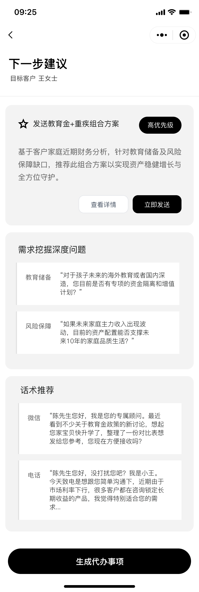

**结构**:

1. `<` 返回 / 胶囊
2. 标题"下一步建议" / 目标客户 王女士
3. **方案卡片**（顶部）:
   - ☆ 发送教育金+重疾组合方案 + 右侧"高优先级"黑色标签
   - 描述文字
   - 两个按钮：白底"查看详情" / 黑底"立即发送"
4. **需求挖掘深度问题**:
   - 教育储备："对于孩子未来的海外教育..."
   - 风险保障："如果未来家庭主力收入出现波动..."
5. **话术推荐**:
   - 微信："陈先生您好，我是您的专属顾问..."
   - 电话："陈先生您好，没打扰您吧？..."
6. 底部黑色大按钮 "生成代办事项"
   - ⚠️ **修正文案**："生成代办事项" → "**生成待办事项**"
   - **点击 → 跳转 `/customers/:id/followup/tasks`**

#### 6.5.2 下一步事项（任务拆解 / 多选）

**路由**: `/customers/:id/followup/tasks`

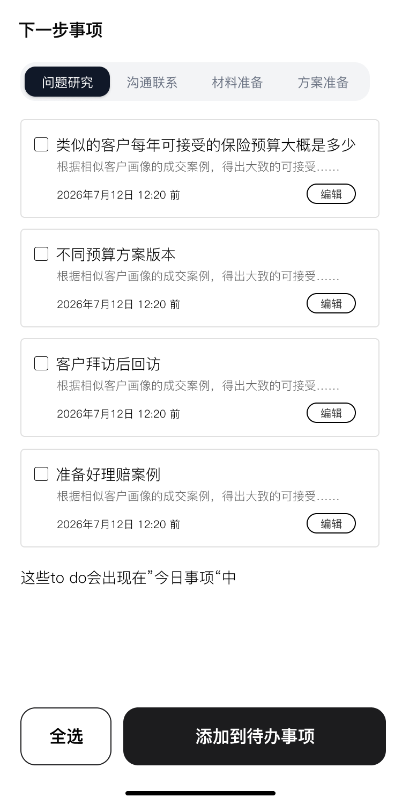

> ⭐ **这是核心功能页之一**。AI 把建议拆成多类多条任务，用户多选 + 编辑后批量加入待办列表。

**结构**:

1. 顶部标题"下一步事项"
2. **分类 tab**（横向 segmented control）：
   - `问题研究`（默认选中）/ `沟通联系` / `材料准备` / `方案准备`
   - 点击切换不同类别，下方任务列表替换（demo 阶段：点击切换 tab 高亮即可，列表保持原样）
3. **任务卡片列表**（4 条样例任务）：
   - 每张卡片：
     - 左侧 ⬜ 复选框
     - 任务标题（如"类似的客户每年可接受的保险预算大概是多少"）
     - 任务描述（"根据相似客户画像的成交案例，得出大致的可接受……"）
     - 时间："2026年7月12日 12:20 前"
     - 右下"编辑"按钮（点击保持当前页，demo 不做实际编辑）
   - 4 条任务：
     1. 类似的客户每年可接受的保险预算大概是多少
     2. 不同预算方案版本
     3. 客户拜访后回访
     4. 准备好理赔案例
4. 列表下方提示文字："这些 to do 会出现在'今日事项'中"
5. 底部固定栏：
   - 左：白底圆角"全选"按钮
   - 右：黑色大按钮"添加到待办事项"
6. **状态变化**：
   - 点击复选框 → 该任务勾选（实心 ✓）
   - 点击"全选" → 全部勾选；再次点击 → 全部取消
   - 点击"添加到待办事项" → **跳转 `/customers/:id/todo-list`**（多日待办列表页）

#### 6.5.3 多日待办列表（静态）

**路由**: `/customers/:id/todo-list`

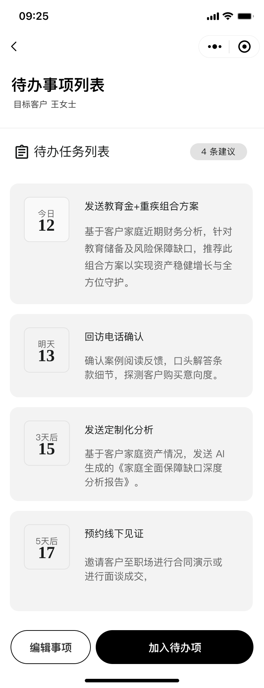

> ⚠️ 标注："**这页做静态页面就行**"，所有元素**仅展示，不可点击**（除了顶部返回）。

**结构**:

1. `<` 返回 / 胶囊
2. 标题"待办事项列表" / 目标客户 王女士
3. 📋 待办任务列表 + 右侧 "4 条建议" 灰色 chip
4. 4 张时间轴卡片：
   - 今日 12 — 发送教育金+重疾组合方案 + 描述
   - 明天 13 — 回访电话确认 + 描述
   - 3天后 15 — 发送定制化分析 + 描述
   - 5天后 17 — 预约线下见证 + 描述
5. 底部固定栏（2 个按钮）：白底"编辑事项" / 黑底"加入待办项"
   - **两个按钮 demo 阶段都仅作返回首页**（即点击 → `/home`），因为本页是静态展示

#### 6.5.4 交互规则汇总

| 触发 | 行为 |
|---|---|
| 下一步建议页"查看详情" | 不响应（demo 不做详情） |
| 下一步建议页"立即发送" | 不响应或 toast |
| 下一步建议页"生成待办事项" | 跳转 `/customers/:id/followup/tasks` |
| 下一步事项页 复选框 | 单条切换勾选 |
| 下一步事项页 "全选" | 全部勾选 / 全部取消 |
| 下一步事项页 "添加到待办事项" | 跳转 `/customers/:id/todo-list` |
| 下一步事项页 "编辑" | 不响应（demo 不做编辑） |
| 下一步事项页 分类 tab | 切换 tab 高亮 |
| 多日待办页 任何按钮 | 返回首页 |

---

### 6.6 工具箱（工具 tab）

**路由**: `/tools`
**底部 tab**: 显示，激活"工具"
**入口**: 底部 tab "工具"

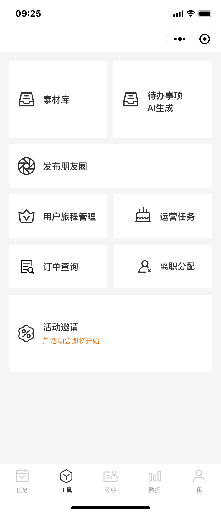

**结构**: 2 × N grid 工具按钮，每个工具一个卡片：

| 工具 | 跳转 |
|---|---|
| 素材库 | `/material` |
| 待办事项 AI 生成 | `/customers/wang/visit-record`（直接进入拜访记录上传态） |
| 发布朋友圈（占整行） | `/material/moments/publish` |
| 用户旅程管理 | `/journey` |
| 运营任务（蛋糕图标） | `/operation` |
| 订单查询 | 不响应或 toast |
| 离职分配 | 不响应或 toast |
| 活动邀请（占整行，带"新活动会即将开始"红字） | `/activity` |

---

### 6.7 自动客户旅程

**入口**: 工具箱"用户旅程管理"

#### 6.7.1 D1 阶段（默认）

**路由**: `/journey`

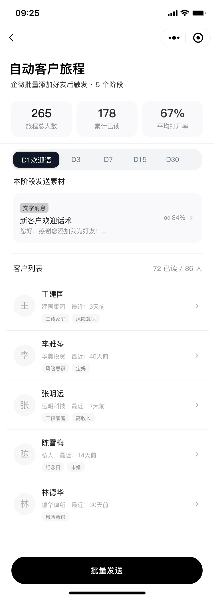

**结构**:

1. `<` 返回 / 胶囊
2. 标题"自动客户旅程" / 副标题"企微批量添加好友后触发 · 5 个阶段"
3. 数据卡片 3 列：265 旅程总人数 / 178 累计已读 / 67% 平均打开率
4. **阶段 tab**（横向，5 个）：`D1 欢迎语`（默认黑底选中）/ `D3` / `D7` / `D15` / `D30`
   - **点击切换** → 替换下方"本阶段发送素材"和"客户列表"内容
   - D3 见 §6.7.2
   - D7 / D15 / D30 demo 阶段保持与 D3 同样的视觉框架即可（内容可省，或显示"内容建设中"）
5. **本阶段发送素材** 卡片：
   - "文字消息" 灰色 chip + 标题"新客户欢迎话术"
   - 内容预览："您好，感谢您添加我为好友！..."
   - 右侧 84% 打开率 + `>`
6. **客户列表** 标题 + "72 已读 / 86 人"
7. 客户行 × 5（王建国 / 李雅琴 / 张明远 / 陈雪梅 / 林德华），格式同 §6.2 客户列表
8. 底部固定黑色大按钮"批量发送"
   - **点击 → 弹出 §6.7.3 modal**

#### 6.7.2 D3 阶段

**路由**: `/journey?stage=D3`

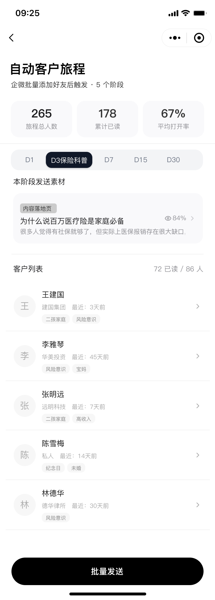

切换到 D3 后，**本阶段发送素材**变为：

- "内容落地页" 灰色 chip + 标题"为什么说百万医疗险是家庭必备"
- 内容预览："很多人觉得有社保就够了，但实际上医保报销存在很大缺口，..."
- 右侧 84% 打开率 + `>`

其余结构不变。

#### 6.7.3 批量发送 modal

**路由（视觉层）**: `/journey/batch-send` 或 modal 状态

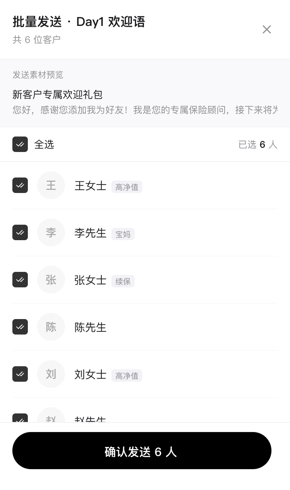

底部上滑 sheet（半屏 modal）：

1. 标题"批量发送 · Day1 欢迎语" + 副标题"共 6 位客户" + 右上 `×` 关闭
2. **发送素材预览**: 标题"新客户专属欢迎礼包" + 内容
3. ✓ 全选 + 右侧"已选 6 人"
4. 客户多选列表（6 行）：每行复选框 + 头像 + 名字 + 标签（高净值 / 宝妈 / 续保 等）
   - 王女士（高净值）/ 李先生（宝妈）/ 张女士（续保）/ 陈先生 / 刘女士（高净值）/ 赵先生（被裁切）
5. 底部黑色大按钮"确认发送 6 人"
   - **点击 → 关闭 modal，回到旅程页**，可选择弹一个"已下发到企微，请到企业微信完成群发"的轻量 toast

#### 6.7.4 交互规则

| 触发 | 行为 |
|---|---|
| 点击 D1/D3/D7/D15/D30 tab | 切换内容 |
| 点击素材卡片 `>` | 不响应（demo 不做素材详情） |
| 点击单个客户行 | 不响应 |
| 点击"批量发送" | 打开 batch-send modal |
| modal 内复选框 / 全选 | 状态切换 |
| modal "确认发送" | 关闭 modal + 可选 toast |
| modal `×` | 关闭 modal |

---

### 6.8 运营任务

**入口**: 工具箱"运营任务"

#### 6.8.1 运营任务列表

**路由**: `/operation`

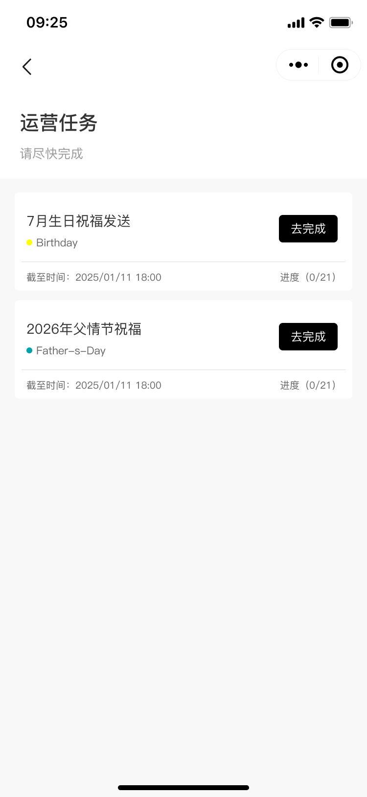

**结构**:

1. `<` 返回 / 胶囊
2. 标题"运营任务" / 副标题"请尽快完成"
3. 任务卡片 × 2：
   - 7月生日祝福发送（Birthday 黄点）+ 右侧黑底"去完成"按钮 + 截至时间 + 进度 (0/21)
   - 2026年父情节祝福（Father-s-Day 青点）+ 右侧黑底"去完成" + 截至时间 + 进度 (0/21)
4. **点击"去完成"** → 跳转 `/operation/:id`

#### 6.8.2 运营任务详情

**路由**: `/operation/:id`

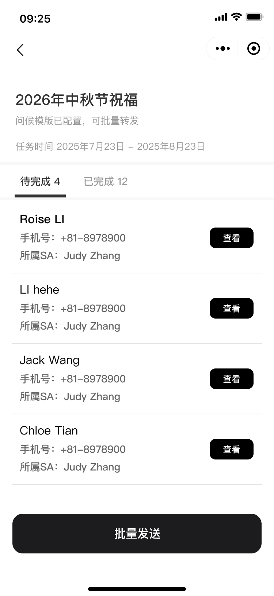

**结构**:

1. `<` 返回 / 胶囊
2. 标题"2026年中秋节祝福" / "问候模版已配置，可批量转发" / 任务时间 2025/7/23 – 2025/8/23
3. 内部 tab: `待完成 4`（默认）/ `已完成 12`
4. 客户列表 × 4：
   - Roise LI / LI hehe / Jack Wang / Chloe Tian
   - 每行：姓名 + 手机号 + 所属SA + 右侧"查看"按钮（点击保持当前页或 toast）
5. 底部固定黑色大按钮"批量发送"
   - **点击** → toast "已下发到企微，请到企业微信完成群发" + 返回 `/operation`

#### 6.8.3 交互规则

| 触发 | 行为 |
|---|---|
| 点击运营任务"去完成" | 跳转详情页 |
| 点击 待完成/已完成 tab | 切换（demo 不真实切数据） |
| 点击"查看" | 不响应或 toast |
| 点击"批量发送" | toast + 返回列表 |

---

### 6.9 内容运营（素材库 / 朋友圈）

**入口**: 工具箱"素材库" / "发布朋友圈"

#### 6.9.1 素材库首页

**路由**: `/material`

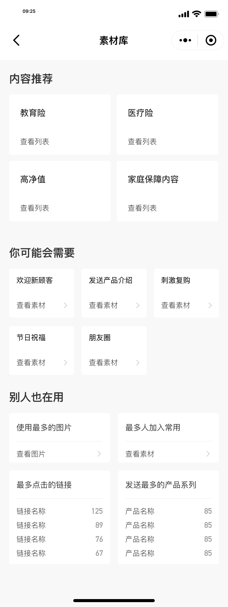

**结构**:

1. `<` 返回 / 标题"素材库" / 胶囊
2. **内容推荐** 2×2 grid:
   - 教育险 / 医疗险 / 高净值 / 家庭保障内容
   - 每格"查看列表"
   - **点击"教育险" → `/material/content?type=education`**
3. **你可能会需要** 3+2 grid:
   - 欢迎新顾客 / 发送产品介绍 / 刺激复购 / 节日祝福 / 朋友圈
   - 每个"查看素材 >"，点击保持当前页或弹简单内容预览（demo 阶段不响应也行）
4. **别人也在用** 2×2 grid:
   - 使用最多的图片 / 最多人加入常用 / 最多点击的链接 / 发送最多的产品系列
   - 链接区列表 / 产品名+数字，demo 阶段不可点击

#### 6.9.2 内容推荐列表（教育险）

**路由**: `/material/content?type=education`

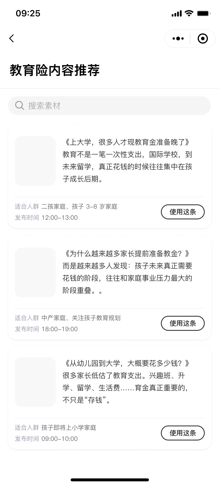

**结构**:

1. `<` 返回 / 标题"教育险内容推荐"
2. 搜索框（仅装饰）
3. 内容卡片 × 3：
   - 左侧灰色缩略图（占位）
   - 标题：《上大学，很多人才现教育金准备晚了》
   - 副文案
   - 底部：适合人群 / 发布时间 + 右侧白色圆角"使用这条"按钮
   - **点击"使用这条"** → 跳转 `/material/moments/publish`

#### 6.9.3 朋友圈素材库

**路由**: `/material/moments`
**入口**: 工具箱 → "发布朋友圈"（如果想先进素材选择则到这里）

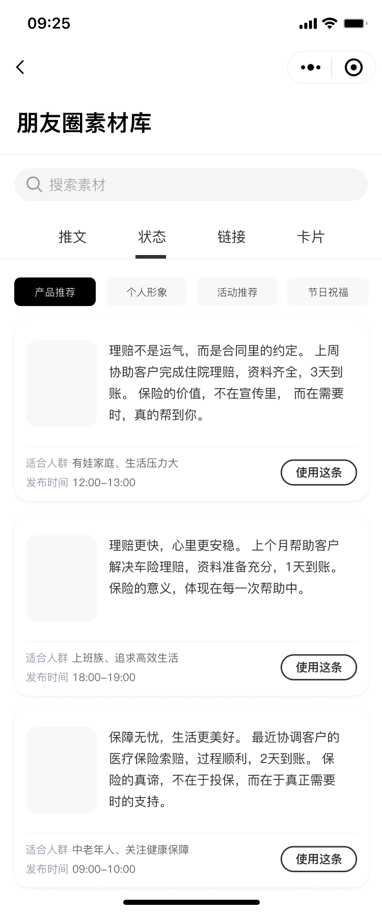

**结构**:

1. `<` 返回 / 标题"朋友圈素材库" / 胶囊
2. 搜索框
3. **一级 tab**（横向）：`推文` / `状态`（默认选中）/ `链接` / `卡片`
4. **二级 tab**（横向 chip）：`产品推荐`（默认选中黑底）/ `个人形象` / `活动推荐` / `节日祝福`
5. 素材卡片 × 3：
   - 左侧灰色缩略图
   - 右侧文案："理赔不是运气，而是合同里的约定。..."
   - 底部：适合人群 / 发布时间 + 白色圆角"使用这条"按钮
   - **点击"使用这条"** → 跳转 `/material/moments/publish`

#### 6.9.4 发布朋友圈

**路由**: `/material/moments/publish`

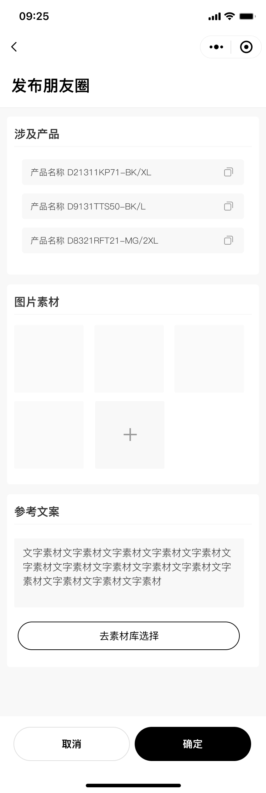

> ⚠️ 注：会议确认 **删除"标签定向"模块**，本页 figma 设计稿已是删除后版本。

**结构**:

1. `<` 返回 / 胶囊
2. 标题"发布朋友圈"
3. **涉及产品** 卡片: 3 个产品名 + 右侧复制图标
4. **图片素材** 卡片: 2 行 × 3 列灰色方块占位，中间一个 `+` 添加按钮（不响应）
5. **参考文案** 卡片:
   - 大段文字素材占位
   - 底部白色圆角"去素材库选择" → **点击跳转 `/material/moments`**
6. 底部固定双按钮：
   - 白底"取消"（点击返回上一页）
   - 黑底"确定" → 点击后 toast "已发布"，返回 `/tools`

#### 6.9.5 内容任务详情页（带数据回传）

**路由**: `/material/content-task/:id`

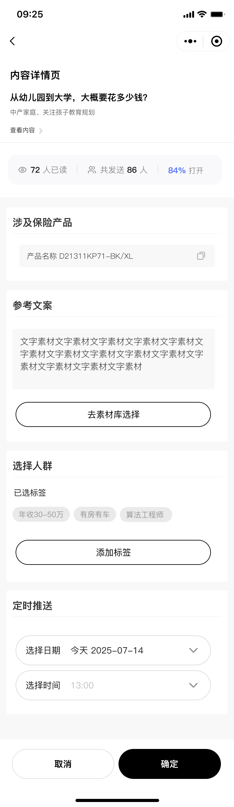

> 这是另一个朋友圈相关页面，**已发布后**的数据回传视图。demo 阶段可作为"从工具栏单独进入"或保留入口但不主动跳转。

**结构**:

1. 顶部胶囊
2. 标题"内容详情页"
3. 子标题"从幼儿园到大学，大概要花多少钱？" + "中产家庭、关注孩子教育规划"
4. "查看内容 >"
5. 数据条: 72 人已读 / 共发送 86 人 / **84% 打开**（蓝色 #3D7BFF）
6. **涉及保险产品** 卡片
7. **参考文案** 卡片 + "去素材库选择"按钮
8. **选择人群** 卡片: 已选标签 chips + "添加标签"按钮
9. **定时推送** 卡片: 选择日期 / 选择时间
10. 底部双按钮：取消 / 确定

#### 6.9.6 素材详情 modal

**路由（modal）**: 从素材库内点击素材"查看详情"打开（demo 可选实现）

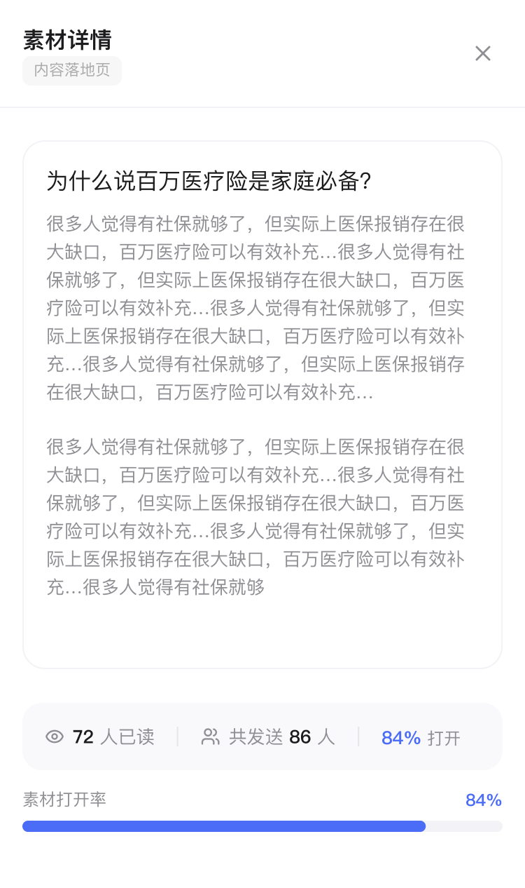

底部上滑 sheet：

1. 标题"素材详情" + "内容落地页" chip + 右上 `×`
2. 内容大块（《为什么说百万医疗险是家庭必备？》）
3. 底部数据: 72 人已读 / 共发送 86 人 / 84% 打开
4. 进度条: 素材打开率 84%

> demo 阶段：本 modal **可不实现**，所有"素材详情"链接保持当前页即可。

#### 6.9.7 交互规则

| 触发 | 行为 |
|---|---|
| 素材库各 tile | 跳转对应列表 |
| 内容推荐"使用这条" | 跳转发布朋友圈 |
| 朋友圈素材库 tab | 切换高亮（数据不变） |
| 朋友圈素材库"使用这条" | 跳转发布朋友圈 |
| 发布朋友圈"去素材库选择" | 跳转素材库 |
| 发布朋友圈"取消" | 返回上一页 |
| 发布朋友圈"确定" | toast + 返回 `/tools` |
| 发布朋友圈 图片 `+` | 不响应 |

---

### 6.10 活动邀约

**入口**: 工具箱"活动邀请" / 首页"为你推荐"活动 tab"报名活动"

#### 6.10.1 活动邀约详情页

**路由**: `/activity`

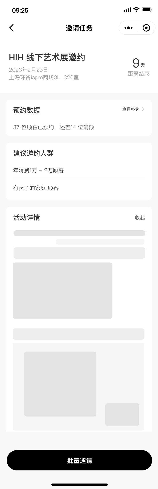

**结构**:

1. `<` 返回 / 标题"邀请任务" / 胶囊
2. 活动头："HIH 线下艺术展邀约" / 副信息 2026年2月23日 / 上海环贸iapm商场3L–320室 / 右侧"9天 距离结束"
3. **预约数据** 卡片: "37 位顾客已预约，还差14 位满额" + "查看记录 >"
   - **点击"查看记录"** → 跳转 `/activity/records`
4. **建议邀约人群** 卡片: "年消费1万 – 2万顾客" / "有孩子的家庭 顾客"
5. **活动详情** 卡片: 灰条占位（保持原样）+ 右上"收起"
6. 底部固定黑色大按钮"批量邀请"
   - **点击 → 跳转 `/activity/invite-list`**

#### 6.10.2 邀约名单

**路由**: `/activity/invite-list`

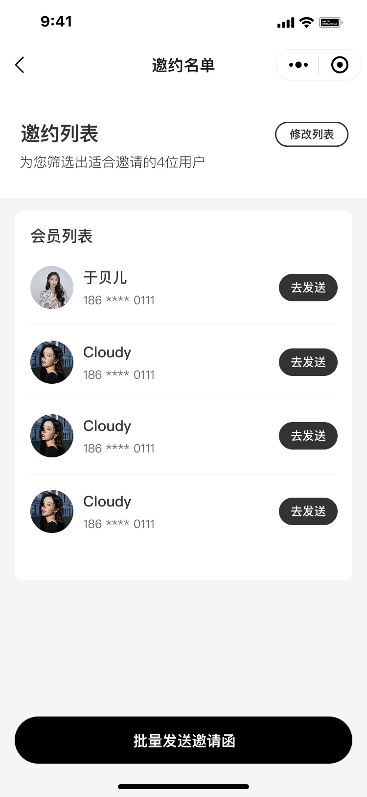

**结构**:

1. `<` 返回 / 标题"邀约名单" / 胶囊
2. 大标题"邀约列表" / "为您筛选出适合邀请的4位用户" + 右侧白色圆角"修改列表"按钮（不响应）
3. **会员列表** 卡片，4 行客户：
   - 于贝儿 / Cloudy / Cloudy / Cloudy
   - 每行：圆形头像 + 名字 + 手机号 + 黑色"去发送"按钮
4. 底部黑色大按钮"批量发送邀请函"
   - **点击 → toast "已下发到企微，请到企业微信完成群发" + 返回 `/activity`**

#### 6.10.3 邀约记录

**路由**: `/activity/records`

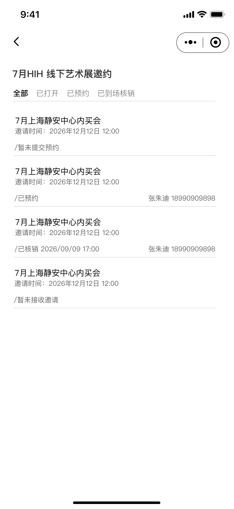

**结构**:

1. `<` 返回 / 胶囊
2. 标题"7月HIH 线下艺术展邀约"
3. **状态 tab**: `全部`（默认）/ `已打开` / `已预约` / `已到场核销`
4. 记录列表 × 4：
   - 7月上海静安中心内买会 + 邀请时间 2026年12月12日 12:00 + 状态行
   - 状态有：暂未提交预约 / 已预约 + 联系人 张朱迪 18990909898 / 已核销 2026/09/09 17:00 + 联系人 / 暂未接收邀请
5. tab 切换：demo 阶段切换高亮，列表保持原样

#### 6.10.4 交互规则

| 触发 | 行为 |
|---|---|
| 活动详情"查看记录" | 跳转邀约记录 |
| 活动详情"批量邀请" | 跳转邀约名单 |
| 邀约名单"去发送"（单个） | 不响应或 toast |
| 邀约名单"修改列表" | 不响应 |
| 邀约名单"批量发送邀请函" | toast + 返回活动详情 |
| 邀约记录 tab | 切换高亮 |

---

## 7. 完整路径汇总（点击流）

### 路径 A — 拜访记录主流程
```
/home  →  快捷工具"拜访记录分析"  →  /customers/wang/visit-record
       →  输入文字、点发送  →  /customers/wang/visit-record?state=done
       →  "生成跟进方案"  →  /customers/wang/followup
       →  "生成待办事项"  →  /customers/wang/followup/tasks
       →  勾选 + "添加到待办事项"  →  /customers/wang/todo-list
       →  返回 /home
```

### 路径 B — 为你推荐主流程
```
/home  →  为你推荐"重点客户"卡片"定制贺卡"  →  /customers/wang
       →  "生成下一步"  →  /customers/wang/followup
       →  "生成待办事项"  →  /customers/wang/followup/tasks
       →  /customers/wang/todo-list
```

### 路径 C — 工具流
```
/home  →  底部 tab "工具"  →  /tools
       →  分别进入各工具：
         · 素材库  /material  →  /material/content?type=education  →  /material/moments/publish
         · 发布朋友圈  /material/moments/publish
         · 用户旅程管理  /journey  →  D1/D3 切换  →  "批量发送" modal
         · 运营任务  /operation  →  /operation/zhongqiu
         · 活动邀请  /activity  →  /activity/invite-list / /activity/records
         · 待办事项 AI 生成  =  /customers/wang/visit-record（同路径 A）
```

### 路径 D — 客户档案流
```
/home  →  底部 tab "顾客"  →  /customers
       →  右上角切换  →  /customers?mode=quadrant
       →  点击客户行  →  /customers/wang
```

---

## 8. 推荐 demo 演示路径

第一次给观众演示时，**建议按下面顺序展示**，能讲完所有核心价值点：

1. **打开 = 首页**：展示分类 tab、任务勾选、为你推荐（切换 3 个 tab）
2. **快捷工具 → 拜访记录分析**：输入 / 发送 / AI 分析展开 / 生成跟进方案
3. **进入跟进方案**：看 AI 推荐方案、话术、生成待办
4. **多类任务拆解**：切分类 tab、勾选、全选、加入待办列表
5. **多日待办列表（静态）**：看到未来 5 天的执行安排
6. **返回首页 → 底部 tab "顾客"**：展示标签模式 ↔ 四象限模式切换
7. **点客户行 → 客户详情**：滚动看热度模型、AI 推荐切入点、家庭结构、保单缺口
8. **底部 tab "工具" → 用户旅程管理**：D1/D3 切换 + 批量发送 modal
9. **回到工具 → 运营任务**：去完成 → 批量发送
10. **回到工具 → 素材库 + 朋友圈**：从素材库选 → 发布朋友圈
11. **回到工具 → 活动邀请**：活动详情 → 邀约名单 → 批量发送邀请函 / 邀约记录

---

## 9. 范围外说明

下面这些**本期 demo 不实现**，但 PRD 保留以备未来扩展：

- 真实企业微信对接 / OAuth / 群发执行
- 管理后台（数据看板、客户分析、任务管理 web 端）
- 数据 tab、我 tab 下的所有页面
- 真实搜索、真实筛选、真实编辑
- 多渠道兜底触达（企微 → 邮件 → 短信）
- 任何后端数据持久化

---

## 10. 验收清单（给开发自检）

- [ ] 所有截图里出现的页面都能在路由表中找到
- [ ] 路径 A、B、C、D 四条主链路全程可点击不卡死
- [ ] 底部 tab bar 在所有"主要页面"显示，在子页面不显示
- [ ] 顶部胶囊 `···` `⊙` 视觉一致（纯装饰）
- [ ] "代办"全部已修正为"**待办**"
- [ ] "客户推荐"全部已修正为"**为你推荐**"+ ✨
- [ ] 底部 tab "灵感"已修正为"**任务**"
- [ ] 所有"建设中" / "不响应"的点击都不抛出报错或白屏
- [ ] iPhone 14/15 视口下视觉与 figma 一致，无横向滚动
- [ ] 假数据来源于 figma 截图，无自创人名/数字

---

**END**
